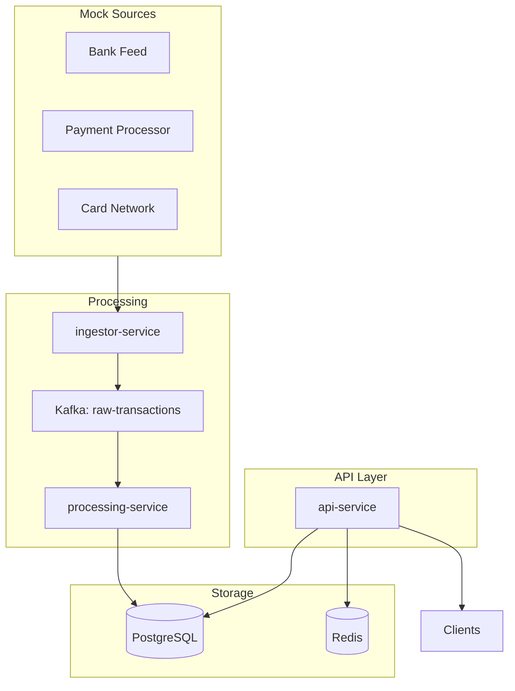
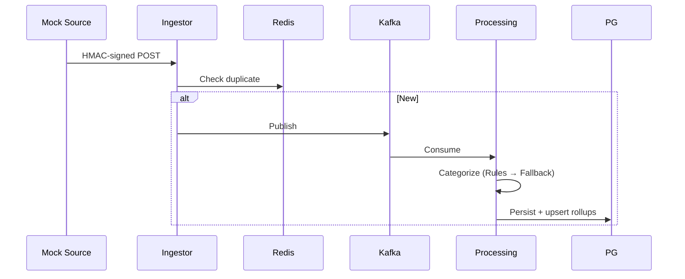
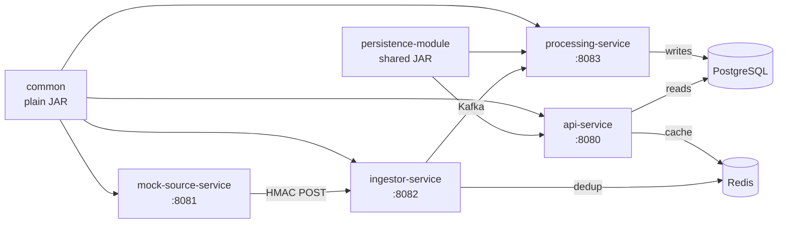
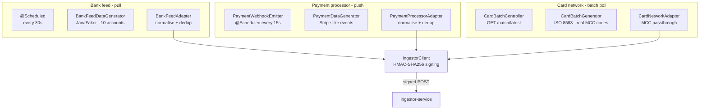
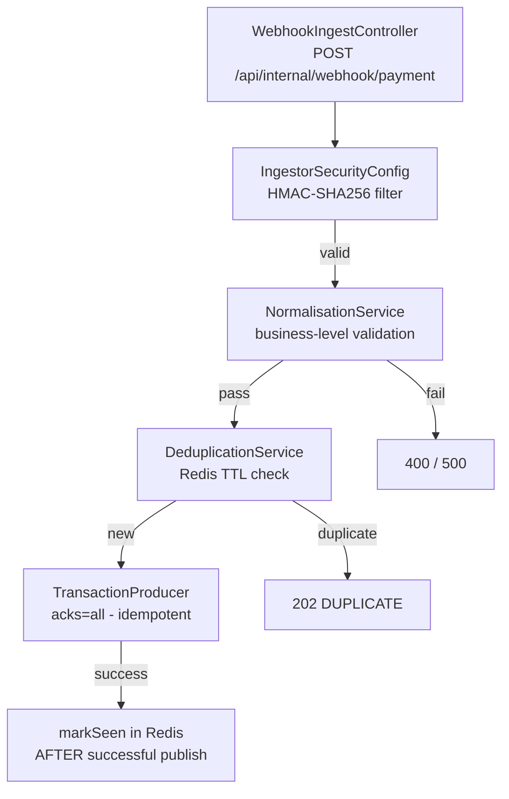
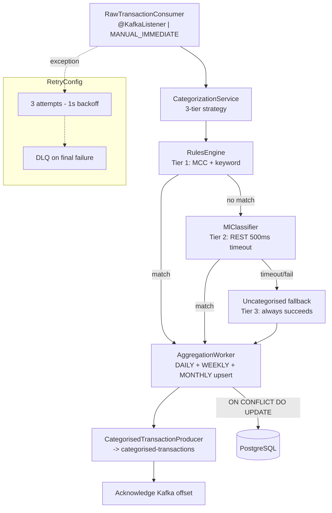
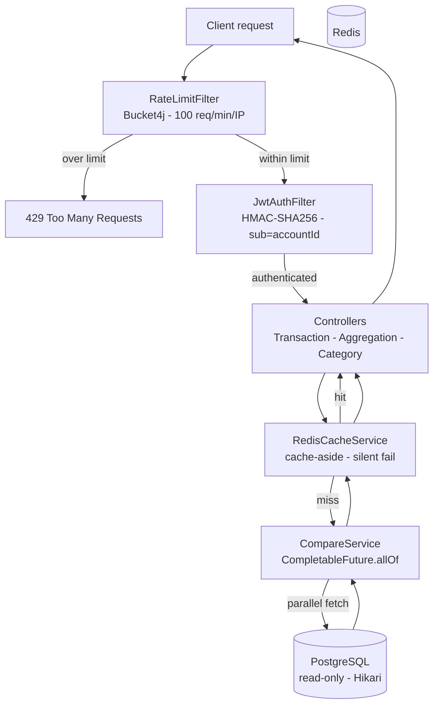
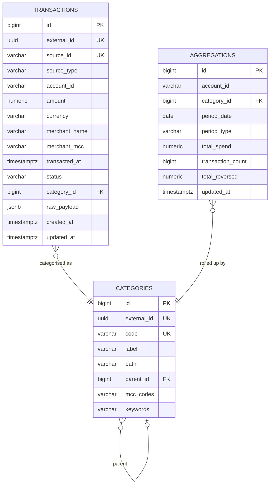

# Transaction Aggregator

> **Implementation** — event-driven financial transaction aggregation platform built with Spring Boot 3.2, Java 21, Apache Kafka, PostgreSQL, and Redis.

---

## Table of Contents

- [Transaction Aggregator](#transaction-aggregator)
  - [Table of Contents](#table-of-contents)
  - [Overview](#overview)
  - [Architecture Highlights](#architecture-highlights)
    - [Core Design Principles](#core-design-principles)
    - [Key Architectural Decisions](#key-architectural-decisions)
    - [Technology Stack](#technology-stack)
    - [Production Considerations](#production-considerations)
  - [Architecture](#architecture)
    - [High-level design](#high-level-design)
    - [Data flow](#data-flow)
    - [Module map](#module-map)
    - [Modules](#modules)
      - [Why Modular?](#why-modular)
    - [Design Patterns Applied](#design-patterns-applied)
      - [Rejected Patterns](#rejected-patterns)
      - [Performance Choices](#performance-choices)
  - [Services in Detail](#services-in-detail)
    - [common](#common)
    - [persistence-module](#persistence-module)
    - [mock-source-service](#mock-source-service)
    - [ingestor-service](#ingestor-service)
    - [processing-service](#processing-service)
    - [api-service](#api-service)
    - [Infrastructure Components](#infrastructure-components)
  - [Prerequisites](#prerequisites)
  - [Running the System](#running-the-system)
    - [Option A: Complete Docker Compose (Recommended)](#option-a-complete-docker-compose-recommended)
    - [Option B: Manual Service Startup (Development)](#option-b-manual-service-startup-development)
    - [Verify the Pipeline](#verify-the-pipeline)
    - [Step 6 — Obtain a JWT token](#step-6--obtain-a-jwt-token)
  - [API Reference](#api-reference)
    - [Transactions](#transactions)
    - [Aggregations](#aggregations)
    - [Categories](#categories)
    - [Postman Collection](#postman-collection)
  - [Kafka Topics](#kafka-topics)
  - [Database Schema](#database-schema)
  - [Configuration](#configuration)
    - [Local development](#local-development)
    - [AWS production](#aws-production)
    - [Profile overview](#profile-overview)
  - [Running Tests](#running-tests)
    - [Comprehensive Test Coverage](#comprehensive-test-coverage)
    - [Unit tests](#unit-tests)
    - [Integration tests (requires Docker)](#integration-tests-requires-docker)
    - [Controller Test Examples](#controller-test-examples)
    - [Test Coverage Achievements](#test-coverage-achievements)
    - [Running Specific Test Categories](#running-specific-test-categories)
    - [Test Configuration](#test-configuration)
  - [Troubleshooting](#troubleshooting)
  - [Tech Stack](#tech-stack)

---

## Overview

The Transaction Aggregator ingests financial transaction data from three simulated sources, categorises each transaction using a rules engine with optional ML fallback, persists results to PostgreSQL, and exposes a comprehensive REST API for querying, comparing, and exporting aggregated spend data.

**Key design decisions:**
- Event-driven architecture with Kafka decouples ingestion from processing
- Redis deduplication (TTL: 24h) guarantees idempotent ingestion
- Pre-computed aggregation rollups mean the API never runs `GROUP BY` on raw transactions
- Cursor-based pagination (`O(1)` at any depth, stable under concurrent inserts)
- Parallel `CompletableFuture` queries halve compare endpoint latency
- Zero-secret production config via AWS Parameter Store + Secrets Manager

---

## Architecture Highlights

### Core Design Principles
- **Event-Driven**: Kafka-based messaging for loose coupling, scalability, and fault tolerance
- **Modular Microservices**: Independent services with clear responsibilities and boundaries
- **Idempotent Processing**: Redis deduplication ensures exactly-once semantics for financial data
- **Performance-First**: Pre-computed aggregations, intelligent caching, and parallel query execution
- **Production-Ready**: Comprehensive security, monitoring, testing, and containerization

### Key Architectural Decisions
1. **Event-Driven over Synchronous REST**: Chosen for loose coupling, scalability, and fault tolerance
2. **Modular over Monolithic**: Enables independent scaling, technology flexibility, and team parallelism
3. **Pre-Computed Aggregations**: Eliminates expensive `GROUP BY` queries at runtime
4. **Redis for Deduplication + Caching**: Single technology for two critical concerns with different TTLs
5. **Three-Tier Categorization**: Rules engine → ML fallback → uncategorized default (balances accuracy, performance, reliability)

### Technology Stack
- **Runtime**: Spring Boot 3.2, Java 21, Docker, Docker Compose
- **Data**: PostgreSQL, Redis, Apache Kafka
- **Security**: JWT authentication, HMAC-SHA256 signing, rate limiting (Bucket4j)
- **Operations**: Health checks, structured logging, comprehensive testing

### Production Considerations
- **Security**: End-to-end signing, authentication, authorization, and input validation
- **Reliability**: Dead-letter queues, retry mechanisms, health checks, and monitoring
- **Performance**: Connection pooling, caching strategies, and query optimization
- **Maintainability**: Clear separation of concerns, comprehensive testing, and documentation

---

## Architecture

### High-level design

The system is structured in three tiers: **Sources** (mock data producers), **Processing** (ingest + categorise + aggregate), and **API** (read-only query layer).



### Data flow

The ingest pipeline is the most critical path — every decision here has correctness implications:



### Module map



### Modules

- **common**: Shared DTOs/enums (no framework dependencies)
- **persistence-module**: JPA entities & repositories (shared by processing & API)
- **mock-source-service**: Simulates three sources with HMAC signing
- **ingestor-service**: Webhook ingestion, validation, deduplication, Kafka publish
- **processing-service**: Categorization, persistence, aggregation upserts
- **api-service**: Read-optimized REST API with caching and parallel queries

#### Why Modular?

- Clear separation of concerns
- Independent scaling
- Technology flexibility

**Trade-off:** Higher orchestration complexity

---

### Design Patterns Applied

- **Strategy**: Categorization (rules engine primary, ML fallback stub)
- **Adapter**: Normalising different source payloads
- **Repository**: Clean data access abstraction
- **Cache-Aside**: Redis for aggregations
- **Observer**: Kafka consumers
- **Decorator (Spring)**: `@Transactional`, `@Cacheable`, retries

#### Rejected Patterns

- **Factory / Command**: Not needed where Spring DI or linear pipeline was sufficient


#### Performance Choices

- **Pre-computed rollups**: Daily/weekly/monthly using
  ```sql
  INSERT ... ON CONFLICT DO UPDATE

---

## Services in Detail

### common

Plain JAR — no Spring, no Kafka, no web. Zero framework dependencies so any module can import it without transitive pollution.

**Package:** `za.co.reed.common` (note: there's a typo in the code as `common` that should be fixed)

| File | Purpose |
|---|---|
| `NormalisedTransaction.java` | Java 21 record — canonical shape of every transaction across all modules. Compact constructor validates all invariants at construction time. Uses `BigDecimal` for amounts, `Currency` for ISO 4217 codes. |
| `SourceType.java` | `BANK_FEED`, `PAYMENT_PROCESSOR`, `CARD_NETWORK` — identifies which mock data source produced a transaction |
| `TransactionStatus.java` | `PENDING`, `SETTLED`, `REVERSED` — financial transaction lifecycle states |
| `KafkaTopics.java` | Topic name constants (`RAW_TRANSACTIONS`, `CATEGORISED_TRANSACTIONS`) with partition/replication config. Single source of truth for Kafka configuration. |
| `PeriodType.java` | `DAILY`, `WEEKLY`, `MONTHLY` — aggregation period types for pre-computed rollups |

### persistence-module

Shared JAR containing JPA entities and Spring Data repositories used by both `processing-service` (writes) and `api-service` (reads). This module provides a clean separation of persistence concerns and ensures both services use identical entity definitions.

**Package:** `za.co.reed.persistence`

| File | Purpose |
|---|---|
| `Transaction.java` | JPA entity mapping to `transactions` table. Includes `@ManyToOne` relationship to `Category`, indexes for common query patterns, and conversion from `NormalisedTransaction`. |
| `Category.java` | JPA entity with `ltree` path for hierarchical categorization. Includes MCC code, keyword mappings, and parent-child relationships. |
| `Aggregation.java` | JPA entity for pre-computed rollups (daily/weekly/monthly). Optimized for `ON CONFLICT DO UPDATE` upserts with composite primary key (account_id, category_id, period_date, period_type). |
| `TransactionRepository.java` | Spring Data JPA repository with custom query methods for transaction lookup, filtering, and cursor-based pagination. |
| `CategoryRepository.java` | Repository with `@Query` methods for hierarchical category queries using PostgreSQL `ltree` extension and MCC code lookups. |
| `AggregationRepository.java` | Repository with aggregation-specific queries used by `api-service` comparison endpoints, including period-based queries and category breakdowns. |

**Design rationale:**
- **Single source of truth**: Both read and write services use the same entity definitions, preventing schema drift between services.
- **Decoupled evolution**: Persistence layer can evolve independently of business logic; schema changes are coordinated through this module.
- **Testability**: Entities and repositories can be unit-tested without Spring context using H2 or test containers.
- **Dependency isolation**: `processing-service` and `api-service` depend only on the persistence module, not on each other's internal persistence implementations.
- **Performance optimization**: Indexes and query methods are designed for actual usage patterns identified during development.

### mock-source-service

Simulates three real-world financial data sources. All three sign every outbound request with HMAC-SHA256 before sending to the ingestor.



**Key differences between sources:**

| Source | Delivery | MCC | Accounts |
|---|---|---|---|
| Bank feed | Scheduled pull (30s) | None — inferred by rules engine | `ACC-0001` … `ACC-0010` |
| Payment processor | Webhook push (15s) | None | Stripe customer IDs `cus_001` … |
| Card network | Batch poll (5min) | Real ISO 18245 codes | PAN last-four digits |

### ingestor-service



**Critical ordering:** `markSeen()` is called **after** `publish()` succeeds. If Kafka publish fails, the `sourceId` stays absent from Redis — the next retry from mock-source-service is accepted and re-attempted. Marking seen before publish would silently drop transactions on broker failures.

**Validation rules (NormalisationService):**
- Rejects transactions dated more than 5 minutes in the future (clock skew tolerance)
- Rejects transactions older than 7 days (stale data guard)
- Rejects amounts above R100,000 (fraud guard)
- Logs a WARNING (not rejection) for REVERSED transactions above R50,000

### processing-service



**Aggregation upsert strategy:**

Every SETTLED transaction triggers three atomic upserts — DAILY, WEEKLY, and MONTHLY rows — using `INSERT ... ON CONFLICT DO UPDATE`. REVERSED transactions increment `total_reversed` only. PENDING transactions are skipped entirely.

```sql
INSERT INTO aggregations (account_id, category_id, period_date, period_type, total_spend, transaction_count, ...)
VALUES (...)
ON CONFLICT (account_id, category_id, period_date, period_type)
DO UPDATE SET
    total_spend       = aggregations.total_spend + EXCLUDED.total_spend,
    transaction_count = aggregations.transaction_count + 1,
    updated_at        = now();
```

### api-service

**Port:** 8080
**Package:** `za.co.reed.apiservice`



**Key Components:**
- **Controllers**: REST endpoints with OpenAPI documentation (Swagger UI available at `/swagger-ui.html`)
- **Services**: Business logic for transactions, aggregations, categories, and comparisons
- **Security**: JWT authentication, HMAC validation, rate limiting
- **Caching**: Redis cache-aside pattern with configurable TTLs
- **Performance**: Parallel query execution, connection pooling, optimized queries

**Compare endpoint parallel execution:**

```
Thread A (api-async-1): SELECT aggregations WHERE period = currentPeriod  ─────┐
                                                                                ├── CompletableFuture.allOf().join()
Thread B (api-async-2): SELECT aggregations WHERE period = previousPeriod ─────┘
```

Both queries are completely independent. Running them in parallel halves the endpoint latency compared to sequential execution.

### Infrastructure Components

While not services in the application sense, these infrastructure components are critical to the system:

| Component | Purpose | Location |
|---|---|---|
| **PostgreSQL** | Primary database for transactions, categories, and aggregations | `infra/postgres/init.sql` |
| **Redis** | Deduplication (24h TTL) and caching (configurable TTL) | Configured in Docker Compose |
| **Kafka** | Event streaming between services | Configured in Docker Compose |
| **Docker Configuration** | Container definitions and orchestration | Root directory Dockerfiles and `docker-compose.yaml` |

---

## Prerequisites

| Tool | Version | Purpose |
|---|---|---|
| Java JDK | 21+ | Required by all Spring Boot services |
| Apache Maven | 3.9+ | Multi-module build |
| Docker Desktop | 4.x+ | Runs PostgreSQL, Redis, Kafka, Zookeeper |
| Docker Compose | v2+ | Orchestrates local infrastructure |
| Git | any | Clone the repository |
| curl or Postman | any | Execute API requests |

---

## Running the System

### Option A: Complete Docker Compose (Recommended)

Start all services (infrastructure + applications) with a single command:

```bash
# Clone and configure
git clone https://github.com/original-shaun-reed/transaction-aggregator.git
cd transaction-aggregator

# Copy environment file (Linux)
cp env.example .env

# Copy environment file (Windows CMD)
copy env.example .env

# Copy environment file (Windows PowerShell)
Copy-Item env.example .env

# Start ALL services (infrastructure + applications)
docker-compose up -d

# Optional: Include Kafka UI and pgAdmin
docker-compose --profile tools up -d

# Check service status
docker-compose ps
```

**Services will start in this order:**
1. **Infrastructure**: PostgreSQL, Redis, Zookeeper → start concurrently
2. **Kafka** → waits for Zookeeper to be healthy
3. **processing-service** → waits for PostgreSQL, Redis, Kafka to be healthy (runs Flyway migrations)
4. **ingestor-service** → waits for processing-service, Kafka, Redis to be healthy
5. **api-service** → waits for processing-service, PostgreSQL, Redis to be healthy
6. **mock-source-service** → waits for ingestor-service, api-service to be healthy (starts last)

> Kafka takes ~30 seconds to become ready. Wait until all containers show `Status: healthy`.

**Docker Build Details:**
- Each service uses a **multi-stage Docker build** with Java 21 (Eclipse Temurin)
- Build stage uses Maven to compile only the required module and its dependencies
- Runtime stage uses Alpine Linux with JRE for minimal image size
- Non-root user (`spring:spring`) for improved security
- JVM optimized for containerized environments with G1GC and memory limits

| Service | URL / Port | Description | Docker Image Size |
|---|---|---|---|
| PostgreSQL | `localhost:5432` | Database (DB: `transaction_aggregator`, user: `transaction_aggregator`) | ~200MB |
| Redis | `localhost:6379` | Cache/deduplication (256MB memory limit) | ~30MB |
| Kafka | `localhost:9092` | Message broker (Confluent 7.6.0) | ~500MB |
| processing-service | `localhost:8083` | Transaction processing & categorization | ~200MB |
| ingestor-service | `localhost:8082` | Webhook ingestion & deduplication | ~200MB |
| api-service | `localhost:8080` | REST API (Swagger UI: `http://localhost:8080/swagger-ui.html`) | ~200MB |
| mock-source-service | `localhost:8081` | Mock transaction data generation | ~200MB |
| Kafka UI | `http://localhost:8090` | Kafka management UI (tools profile) | ~200MB |
| pgAdmin | `http://localhost:8091` | PostgreSQL admin UI (tools profile) | ~400MB |

### Option B: Manual Service Startup (Development)

For development where you need to rebuild and restart individual services:

```bash
# Step 1 — Start infrastructure only
docker-compose up -d postgres redis zookeeper kafka

# Optional tools
docker-compose --profile tools up -d

# Step 2 — Build all modules
mvn clean install -DskipTests

# Step 3 — Start services manually (in separate terminals)
# Each service can be started from its module directory
cd processing-service && mvn spring-boot:run -Dspring-boot.run.profiles=dev
cd ingestor-service && mvn spring-boot:run -Dspring-boot.run.profiles=dev
cd api-service && mvn spring-boot:run -Dspring-boot.run.profiles=dev
cd mock-source-service && mvn spring-boot:run -Dspring-boot.run.profiles=dev

# Alternative: Build and run from root with module selection
mvn spring-boot:run -pl api-service -am -Dspring-boot.run.profiles=dev
```

**Development Tips:**
- Use `-DskipTests` for faster builds during development
- The `-am` flag builds dependencies automatically
- Each service runs on its designated port (8080-8083)
- Health endpoints available at `/actuator/health` for each service
- Swagger UI available at `http://localhost:8080/swagger-ui.html` for API exploration

### Verify the Pipeline

```bash
# Check ingestor health
curl http://localhost:8082/actuator/health

# Check api-service health
curl http://localhost:8080/actuator/health

# Check processing-service health
curl http://localhost:8083/actuator/health

# Check mock-source-service health
curl http://localhost:8081/actuator/health
```

Browse to `http://localhost:8090` (Kafka UI) to see messages flowing on the `raw-transactions` and `categorised-transactions` topics.

### Step 6 — Obtain a JWT token

All API endpoints require `Authorization: Bearer {token}`.

For local dev, generate a token at [jwt.io](https://jwt.io) using:

```
Algorithm: HS256
Secret:    dev-jwt-secret-min-256-bits-change-in-prod
Payload:   {
              "sub": "ACC-0001",
              "roles": ["ROLE_USER"],
              "exp": <future Unix timestamp>
           }
```

```bash
# Store token in shell variable

# Linux
export TOKEN="eyJhbGciOiJIUzI1NiIsInR5cCI6IkpXVCJ9..."

# Windows CMD
set TOKEN=eyJhbGciOiJIUzI1NiIsInR5cCI6IkpXVCJ9...

# Windows PowerShell
$env:TOKEN="eyJhbGciOiJIUzI1NiIsInR5cCI6IkpXVCJ9..."
```

The Swagger UI at `http://localhost:8080/swagger-ui.html` has an **Authorize** button — paste your token there to test all endpoints interactively.

---

## API Reference

> Base URL: `http://localhost:8080/api/v1`
> Auth header: `Authorization: Bearer $TOKEN`

---

### Transactions

| Method | Path | Description |
|---|---|---|
| `GET` | `/transactions` | Paginated list — filter by `accountId`, `status`, `from`, `to`, `page`, `pageSize`, `order`, `sort`. Returns `DataResponse<TransactionResponse>` with pagination metadata. |
| `GET` | `/transactions/{id}` | Fetch a single transaction by its UUID. |
| `GET` | `/transactions/search` | Search transactions by merchant name — `?merchantName=Pick+n+Pay`. Optional date filtering, pagination, and sorting. |

**List transactions:**

```bash
# Linux / macOS
curl -H "Authorization: Bearer $TOKEN" \
  'http://localhost:8080/api/v1/transactions?accountId=ACC-0001&status=SETTLED&from=2026-03-01&to=2026-03-31&page=0&pageSize=20&order=createdAt&sort=asc'
```

```cmd
:: Windows CMD
curl -H "Authorization: Bearer %TOKEN%" "http://localhost:8080/api/v1/transactions?accountId=ACC-0001&status=SETTLED&from=2026-03-01&to=2026-03-31&page=0&pageSize=20&order=createdAt&sort=asc"
```

```powershell
# Windows PowerShell
curl -H "Authorization: Bearer $env:TOKEN" "http://localhost:8080/api/v1/transactions?accountId=ACC-0001&status=SETTLED&from=2026-03-01&to=2026-03-31&page=0&pageSize=20&order=createdAt&sort=asc"
```

> **Query params:** `accountId` (optional), `status` — `PENDING` | `SETTLED` | `REVERSED` (optional), `from` / `to` ISO-8601 (optional), `page` (default: 0), `pageSize` (max: 1000, default: 20), `order` — `createdAt` | `amount` | `merchantName` (default: `createdAt`), `sort` — `asc` | `desc` (default: `asc`).

---

**Get transaction by ID:**

```bash
# Linux / macOS
curl -H "Authorization: Bearer $TOKEN" \
  http://localhost:8080/api/v1/transactions/550e8400-e29b-41d4-a716-446655440000
```

```cmd
:: Windows CMD
curl -H "Authorization: Bearer %TOKEN%" "http://localhost:8080/api/v1/transactions/550e8400-e29b-41d4-a716-446655440000"
```

```powershell
# Windows PowerShell
curl -H "Authorization: Bearer $env:TOKEN" "http://localhost:8080/api/v1/transactions/550e8400-e29b-41d4-a716-446655440000"
```

---

**Search by merchant name:**

```bash
# Linux / macOS
curl -H "Authorization: Bearer $TOKEN" \
  'http://localhost:8080/api/v1/transactions/search?merchantName=Amazon&from=2026-03-01&to=2026-03-31&page=0&pageSize=20&order=createdAt&sort=asc'
```

```cmd
:: Windows CMD
curl -H "Authorization: Bearer %TOKEN%" "http://localhost:8080/api/v1/transactions/search?merchantName=Amazon&from=2026-03-01&to=2026-03-31&page=0&pageSize=20&order=createdAt&sort=asc"
```

```powershell
# Windows PowerShell
curl -H "Authorization: Bearer $env:TOKEN" "http://localhost:8080/api/v1/transactions/search?merchantName=Amazon&from=2026-03-01&to=2026-03-31&page=0&pageSize=20&order=createdAt&sort=asc"
```

> **Query params:** `merchantName` (required, case-insensitive), `from` / `to` ISO-8601 (optional), `page` (default: 0), `pageSize` (max: 1000, default: 20), `order` — `createdAt` | `amount` | `merchantName` (default: `createdAt`), `sort` — `asc` | `desc` (default: `asc`).

---

### Aggregations

| Method | Path | Description |
|---|---|---|
| `GET` | `/aggregations/{accountId}/summary` | Total spend, count, and top category breakdown for a period. Cached 5 min. |
| `POST` | `/aggregations/{accountId}/compare` | Period-over-period delta — absolute, percentage, by category, anomalies. Parallel DB fetch. Cached 5 min. (Uses request body) |
| `GET` | `/aggregations/{accountId}/time-series` | Spend over time grouped by `DAILY`, `WEEKLY`, or `MONTHLY`. |
| `GET` | `/aggregations/{accountId}/top-merchants` | Top N merchants ranked by total spend, filtered by status. Cached 2 min. |
| `GET` | `/aggregations/{accountId}/by-category` | Spend and count broken down by category. |

**Summary:**

```bash
# Linux / macOS
curl -H "Authorization: Bearer $TOKEN" \
  'http://localhost:8080/api/v1/aggregations/ACC-0001/summary?periodType=DAILY&from=2026-03-01&to=2026-03-31'
```

```cmd
:: Windows CMD
curl -H "Authorization: Bearer %TOKEN%" "http://localhost:8080/api/v1/aggregations/ACC-0001/summary?periodType=DAILY&from=2026-03-01&to=2026-03-31"
```

```powershell
# Windows PowerShell
curl -H "Authorization: Bearer $env:TOKEN" "http://localhost:8080/api/v1/aggregations/ACC-0001/summary?periodType=DAILY&from=2026-03-01&to=2026-03-31"
```

> **Query params:** `periodType` — `DAILY` | `WEEKLY` | `MONTHLY`, `from` / `to` ISO-8601.

---

**Compare (period-over-period) — `POST`:**

```bash
# Linux / macOS
curl -H "Authorization: Bearer $TOKEN" \
  -H "Content-Type: application/json" \
  -d '{"currentFrom":"2026-03-01","currentTo":"2026-03-31","previousFrom":"2026-02-01","previousTo":"2026-02-28","periodType":"MONTHLY","includeAnomalies":true}' \
  'http://localhost:8080/api/v1/aggregations/ACC-0001/compare'
```

```cmd
:: Windows CMD
curl -H "Authorization: Bearer %TOKEN%" -H "Content-Type: application/json" -d "{\"currentFrom\":\"2026-03-01\",\"currentTo\":\"2026-03-31\",\"previousFrom\":\"2026-02-01\",\"previousTo\":\"2026-02-28\",\"periodType\":\"MONTHLY\",\"includeAnomalies\":true}" "http://localhost:8080/api/v1/aggregations/ACC-0001/compare"
```

```powershell
# Windows PowerShell
curl -H "Authorization: Bearer $env:TOKEN" -H "Content-Type: application/json" -d '{"currentFrom":"2026-03-01","currentTo":"2026-03-31","previousFrom":"2026-02-01","previousTo":"2026-02-28","periodType":"MONTHLY","includeAnomalies":true}' "http://localhost:8080/api/v1/aggregations/ACC-0001/compare"
```

Request body:
```json
{
  "currentFrom":  "2026-03-01",
  "currentTo":    "2026-03-31",
  "previousFrom": "2026-02-01",
  "previousTo":   "2026-02-28",
  "periodType":   "MONTHLY",
  "includeAnomalies": true
}
```

Response shape:
```json
{
  "current":    { "from": "2026-03-01", "to": "2026-03-31", "totalSpend": 14823.50, "transactionCount": 312 },
  "previous":   { "from": "2026-02-01", "to": "2026-02-28", "totalSpend": 12100.00, "transactionCount": 289 },
  "delta":      { "spendAbsolute": 2723.50, "spendPct": 22.51, "countAbsolute": 23, "direction": "INCREASE" },
  "byCategory": [
    { "categoryId": "groceries", "label": "Groceries", "currentSpend": 3200.00,
      "previousSpend": 2800.00, "deltaPct": 14.29, "shareOfTotalCurrent": 21.59 }
  ],
  "timeSeries": [{ "period": "2026-03-01", "current": 540.00, "previous": 490.00 }],
  "anomalies":  [{ "categoryId": "travel", "reason": "SPIKE", "zScore": 3.4,
                   "description": "Travel spend 340% above previous period" }],
  "meta":       { "cached": false, "cacheTtlSeconds": 300, "generatedAt": "2026-03-22T10:42:00Z" }
}
```

---

**Time-series:**

```bash
# Linux / macOS
curl -H "Authorization: Bearer $TOKEN" \
  'http://localhost:8080/api/v1/aggregations/ACC-0001/time-series?periodType=MONTHLY&from=2026-01-01&to=2026-03-31'
```

```cmd
:: Windows CMD
curl -H "Authorization: Bearer %TOKEN%" "http://localhost:8080/api/v1/aggregations/ACC-0001/time-series?periodType=MONTHLY&from=2026-01-01&to=2026-03-31"
```

```powershell
# Windows PowerShell
curl -H "Authorization: Bearer $env:TOKEN" "http://localhost:8080/api/v1/aggregations/ACC-0001/time-series?periodType=MONTHLY&from=2026-01-01&to=2026-03-31"
```

> **Query params:** `periodType` — `DAILY` | `WEEKLY` | `MONTHLY`, `from` / `to` ISO-8601.

---

**Top merchants:**

```bash
# Linux / macOS
curl -H "Authorization: Bearer $TOKEN" \
  'http://localhost:8080/api/v1/aggregations/ACC-0001/top-merchants?status=SETTLED&from=2026-03-01&to=2026-03-31&limit=10'
```

```cmd
:: Windows CMD
curl -H "Authorization: Bearer %TOKEN%" "http://localhost:8080/api/v1/aggregations/ACC-0001/top-merchants?status=SETTLED&from=2026-03-01&to=2026-03-31&limit=10"
```

```powershell
# Windows PowerShell
curl -H "Authorization: Bearer $env:TOKEN" "http://localhost:8080/api/v1/aggregations/ACC-0001/top-merchants?status=SETTLED&from=2026-03-01&to=2026-03-31&limit=10"
```

> **Query params:** `status` — `PENDING` | `SETTLED` | `REVERSED` (optional), `from` / `to` ISO-8601, `limit` (default: 10).

---

**By category:**

```bash
# Linux / macOS
curl -H "Authorization: Bearer $TOKEN" \
  'http://localhost:8080/api/v1/aggregations/ACC-0001/by-category?from=2026-03-01&to=2026-03-31'
```

```cmd
:: Windows CMD
curl -H "Authorization: Bearer %TOKEN%" "http://localhost:8080/api/v1/aggregations/ACC-0001/by-category?from=2026-03-01&to=2026-03-31"
```

```powershell
# Windows PowerShell
curl -H "Authorization: Bearer $env:TOKEN" "http://localhost:8080/api/v1/aggregations/ACC-0001/by-category?from=2026-03-01&to=2026-03-31"
```

---

### Categories

| Method | Path | Description |
|---|---|---|
| `GET` | `/categories` | Full category hierarchy ordered by ltree path (parents before children). Includes MCC codes and keyword mappings. Supports pagination and sorting. |
| `GET` | `/categories/{id}` | Look up a single category by UUID. Returns full metadata including parent/child relationships. |
| `GET` | `/categories/mcc` | Batch lookup categories by MCC code(s) — accepts comma-separated list via `?mccCodes=5411,5812`. Supports pagination and sorting. |

**Category list** (seeded from Flyway V2 migration):

```bash
# Linux / macOS
curl -H "Authorization: Bearer $TOKEN" \
  'http://localhost:8080/api/v1/categories?page=0&pageSize=50&order=path&sort=asc'
```

```cmd
:: Windows CMD
curl -H "Authorization: Bearer %TOKEN%" "http://localhost:8080/api/v1/categories?page=0&pageSize=50&order=path&sort=asc"
```

```powershell
# Windows PowerShell
curl -H "Authorization: Bearer $env:TOKEN" "http://localhost:8080/api/v1/categories?page=0&pageSize=50&order=path&sort=asc"
```

> **Query params:** `page` (default: 0), `pageSize` (max: 100, default: 20), `order` — `path` | `label` | `code` (default: `path`), `sort` — `asc` | `desc` (default: `asc`).

---

**Lookup by ID:**

```bash
# Linux / macOS
curl -H "Authorization: Bearer $TOKEN" \
  http://localhost:8080/api/v1/categories/550e8400-e29b-41d4-a716-446655440000
```

```cmd
:: Windows CMD
curl -H "Authorization: Bearer %TOKEN%" "http://localhost:8080/api/v1/categories/550e8400-e29b-41d4-a716-446655440000"
```

```powershell
# Windows PowerShell
curl -H "Authorization: Bearer $env:TOKEN" "http://localhost:8080/api/v1/categories/550e8400-e29b-41d4-a716-446655440000"
```

---

**Lookup by MCC codes:**

```bash
# Linux / macOS
curl -H "Authorization: Bearer $TOKEN" \
  'http://localhost:8080/api/v1/categories/mcc?mccCodes=5411,5812,5921&page=0&pageSize=20&order=label&sort=asc'
```

```cmd
:: Windows CMD
curl -H "Authorization: Bearer %TOKEN%" "http://localhost:8080/api/v1/categories/mcc?mccCodes=5411,5812,5921&page=0&pageSize=20&order=label&sort=asc"
```

```powershell
# Windows PowerShell
curl -H "Authorization: Bearer $env:TOKEN" "http://localhost:8080/api/v1/categories/mcc?mccCodes=5411,5812,5921&page=0&pageSize=20&order=label&sort=asc"
```

> **Query params:** `mccCodes` comma-separated ISO 18245 codes (required), `page` (default: 0), `pageSize` (max: 100, default: 20), `order` — `path` | `label` | `code` (default: `label`), `sort` — `asc` | `desc` (default: `asc`).

### Postman Collection

A complete Postman collection is available for testing the API service:

- **File**: [`transaction-aggregator-api.postman_collection.json`](transaction-aggregator-api.postman_collection.json)
- **Description**: Contains all production API endpoints with pre-configured authentication, variables, and example requests
- **Features**:
  - Pre-configured environment variables (base URL, JWT token, sample account IDs)
  - Organized by endpoint categories (Transactions, Aggregations, Categories)
  - Example requests with realistic payloads and date ranges
  - Authentication setup with Bearer token
  - Detailed parameter descriptions for each endpoint

**Import Instructions**:
1. Download the [`transaction-aggregator-api.postman_collection.json`](transaction-aggregator-api.postman_collection.json) file
2. Open Postman and click "Import"
3. Select the downloaded file
4. Set the `jwt_token` variable with a valid JWT token (obtain from your auth service or the running system)
5. Update `base_url` if running on a different host/port
6. Use sample account IDs: `ACC-0001` through `ACC-0010` (bank feed), or `cus_001` through `cus_005` (payment processor)
---

## Kafka Topics

| Topic | Partitions | Replication | Producer | Consumer |
|---|---|---|---|---|
| `raw-transactions` | 6 | 1 (dev) / 3 (prod) | ingestor-service | processing-service |
| `categorised-transactions` | 6 | 1 (dev) / 3 (prod) | processing-service | downstream analytics |
| `raw-transactions.dlq` | 1 | 1 (dev) / 3 (prod) | RetryConfig | DeadLetterConsumer |

**Topic Creation:**

Topics are automatically created when first referenced (auto-creation enabled in development via `KAFKA_AUTO_CREATE_TOPICS_ENABLE: "true"`). For manual creation in production environments, use the following commands:
```bash
docker exec transaction-aggregator-kafka kafka-topics --create \
  --topic raw-transactions \
  --partitions 6 \
  --replication-factor 1 \
  --bootstrap-server localhost:9092

docker exec transaction-aggregator-kafka kafka-topics --create \
  --topic raw-transactions.dlq \
  --partitions 1 \
  --replication-factor 1 \
  --bootstrap-server localhost:9092

docker exec transaction-aggregator-kafka kafka-topics --create \
  --topic categorised-transactions \
  --partitions 6 \
  --replication-factor 1 \
  --bootstrap-server localhost:9092
```

**Producer config (ingestor-service):**
```yaml
acks: all
enable.idempotence: true
retries: 3
max.in.flight.requests.per.connection: 1
```

**Consumer config (processing-service):**
```yaml
ack-mode: MANUAL_IMMEDIATE   # offset committed only after pipeline succeeds
max.poll.records: 100
auto-offset-reset: earliest
enable-auto-commit: false
```

---

## Database Schema


> **ID strategy:** Internal primary keys are `BIGSERIAL` (`BIGINT`). `UUID` columns (`external_id`) are generated via `gen_random_uuid()` and used exclusively for external-facing API identifiers. This keeps internal joins fast and index-compact while keeping external IDs opaque and non-guessable.

**Schema ownership:** Flyway in `processing-service` owns all migrations (V1–V3). The `api-service` sets `ddl-auto: validate` and the Hikari datasource to `read-only: true`.

**Key design decisions:**

- Internal PKs are `BIGSERIAL` — fast joins, small indexes, no UUID generation overhead on every insert
- `external_id` columns are `UUID` (generated by the DB via `gen_random_uuid()`) — used in all API paths and responses, opaque and non-guessable
- `transactions.source_id` has a unique constraint — DB-level idempotency guard even if Redis dedup is bypassed
- `transactions.raw_payload` is stored as `JSONB` with a GIN index — enables field-level querying and full replay without going back to source
- `categories.path` is `VARCHAR` — uses a dot-notation hierarchy (e.g. `food_and_dining.groceries`) rather than the `ltree` extension
- `categories` self-references via `parent_id` with `ON DELETE NO ACTION` — tree structure is preserved, orphan prevention is application-responsibility
- `aggregations` unique constraint on `(account_id, category_id, period_date, period_type)` makes `ON CONFLICT DO UPDATE` atomic
- `aggregations.transaction_count` is `BIGINT`, not `INT` — consistent with high-volume append workloads
- `transactions.status` is constrained to `PENDING`, `SETTLED`, `REVERSED`; `source_type` to `BANK_FEED`, `PAYMENT_PROCESSOR`, `CARD_NETWORK`
- `aggregations.period_type` is constrained to `DAILY`, `WEEKLY`, `MONTHLY`

---

## Configuration

### Local development

Copy `env.example` to `.env`. All defaults are configured for local Docker Compose — no changes needed for standard local development.

```bash
# Copy environment file (Linux)
cp env.example .env

# Copy environment file (Windows CMD)
copy env.example .env

# Copy environment file (Windows PowerShell)
Copy-Item env.example .env
```

### AWS production

In production, secrets are fetched at startup via Spring Cloud AWS — no environment variables needed for sensitive values:

**Parameter Store** (non-sensitive config):
```
/transaction_aggregator/prod/api/db-host
/transaction_aggregator/prod/api/redis-host
/transaction_aggregator/prod/processing/kafka-bootstrap-servers
/transaction_aggregator/prod/ingestor/webhook-url
```

**Secrets Manager** (sensitive — supports rotation):
```
transaction_aggregator/prod/db-credentials    → { "username": "...", "password": "..." }
transaction_aggregator/prod/api-secrets       → { "jwt-secret": "...", "redis-password": "..." }
transaction_aggregator/prod/ingestor-secrets  → { "webhook-secret": "..." }
```

The ECS task role / EC2 instance profile needs these IAM permissions:
```
ssm:GetParametersByPath
secretsmanager:GetSecretValue
```

### Profile overview

| Profile | Swagger UI | DB | Kafka | Secrets |
|---|---|---|---|---|
| `dev` | Enabled at `:8080/swagger-ui.html` | Local Docker | `localhost:9092` | `.env` file |
| `prod` | Disabled | AWS RDS | AWS MSK (IAM auth) | Parameter Store + Secrets Manager |

---

## Running Tests

### Comprehensive Test Coverage

> **Detailed Analysis**: For a comprehensive analysis of the test suite including coverage metrics, test architecture, improvement recommendations, and the layered testing strategy diagram, see [`TEST_ANALYSIS.md`](TEST_ANALYSIS.md).

The project features comprehensive test coverage across all modules with **35+ test classes** and **350+ individual test methods**. The test suite provides robust validation of the entire transaction aggregation pipeline from ingestion through processing to API delivery.

**Test Architecture**: The suite follows a layered testing strategy with integration tests (Testcontainers), controller tests (`@WebMvcTest`), service tests (Mockito), and repository tests (`@DataJpaTest`). See the detailed architecture diagram in [`TEST_ANALYSIS.md`](TEST_ANALYSIS.md).

**Current Test Statistics:**
- **Total Test Classes**: 35+ (comprehensive coverage across all 6 modules)
- **Total Test Methods**: 350+ (extensive validation of business logic and edge cases)
- **Test Types**: Unit tests, integration tests, controller tests, security tests
- **Coverage Strategy**: Multi-layered testing with mocks, Testcontainers, and in-memory databases
- **Integration Coverage**: Full end-to-end pipeline validation with PostgreSQL, Redis, and Kafka

The test suite includes:

- **Controller Layer Tests**: Isolated `@WebMvcTest` for all REST controllers with proper authentication and validation
- **Service Layer Tests**: Mock-based unit tests for business logic with comprehensive edge case coverage
- **Integration Tests**: Full-stack `@SpringBootTest` with Testcontainers for PostgreSQL, Redis, and Kafka
- **Security Tests**: JWT authentication, HMAC webhook signing, and rate limiting validation
- **Repository Tests**: Database interaction tests with in-memory H2 and proper transaction boundaries
- **Kafka Tests**: Producer/consumer integration tests with real Kafka topics
- **Data Generation Tests**: Realistic mock data generation and source adaptation tests

### Unit tests

```bash
# first install modules
mvn install

# All modules
mvn test

# Single module
cd api-service && mvn test
cd processing-service && mvn test
cd common && mvn test
cd ingestor-service && mvn test
cd mock-source-service && mvn test
```

**Comprehensive Test Suites by Module:**

| Module | Test Classes | Coverage Focus | Test Count |
|---|---|---|---|
| **api-service** | `TransactionControllerTest`, `CategoryServiceTest`, `AggregationServiceTest`, `TransactionServiceTest`, `CategoryControllerTest`, `AggregationControllerTest`, `ApiIntegrationTest` | Service layer business logic, REST API endpoints, validation, and full-stack integration | 100+ tests |
| **common** | `KafkaTopicsTest`, `NormalisedTransactionTest`, `SourceTypeTest`, `TransactionStatusTest` | Shared DTOs, enums, and Kafka topic configuration validation | 20+ tests |
| **ingestor-service** | `DeduplicationServiceTest`, `IngestorServiceTest`, `NormalisationServiceTest`, `TransactionProducerTest`, `WebhookIngestControllerTest` | Deduplication, ingestion logic, Kafka publishing, and webhook validation | 60+ tests |
| **processing-service** | `RulesEngineTest`, `CategorisationServiceTest`, `RawTransactionConsumerTest`, `CategoryRepositoryTest`, `CategorisedTransactionProducerTest` | Categorization logic, Kafka consumption, database persistence, and aggregation | 70+ tests |
| **mock-source-service** | `BankFeedAdapterTest`, `CardNetworkAdapterTest`, `PaymentProcessorAdapterTest`, `BankFeedSchedulerTest`, `PaymentWebhookEmitterTest`, `CardBatchControllerTest`, `IngestorClientTest`, `BankFeedDataGeneratorTest`, `CardBatchGeneratorTest`, `PaymentDataGeneratorTest`, `PropertiesClassesTest` | Data generation, source adaptation, HMAC signing, and scheduled job execution | 70+ tests |

### Integration tests (requires Docker)

Integration tests use Testcontainers — they spin up real PostgreSQL and Kafka containers automatically. Docker must be running.

```bash
mvn verify
```

### Controller Test Examples

The newly created controller tests use `@WebMvcTest` for isolated testing:

```java
@WebMvcTest(CategoryControllerImpl.class)
class CategoryControllerTest {
    @MockBean private CategoryService categoryService;
    @Autowired private MockMvc mockMvc;
    
    @Test
    void listCategories_returnsOk() throws Exception {
        // Test implementation
    }
}
```

### Test Coverage Achievements

The project has achieved comprehensive test coverage with the following characteristics:

- **Test Volume**: 35+ test classes with 350+ individual test methods (recently expanded)
- **Coverage Breadth**: All critical business logic paths validated including newly added controller and service tests
- **Integration Coverage**: Full end-to-end pipeline testing with Testcontainers
- **Security Coverage**: JWT authentication, HMAC signing, and rate limiting thoroughly tested
- **Data Flow Coverage**: Complete validation of ingestion → processing → aggregation → API response chain
- **Recent Test Additions**:
  - `TransactionControllerTest` - Comprehensive controller tests with 12 test methods
  - Enhanced `CategoryServiceTest` - 15 test methods covering cache integration and error scenarios
  - Enhanced `AggregationServiceTest` - 15 test methods covering aggregation logic and edge cases

**Key Coverage Areas:**
- **Ingestion Pipeline**: HMAC validation, deduplication, Kafka publishing
- **Categorization Logic**: Rules engine, ML fallback, category assignment
- **Aggregation Engine**: Daily/monthly rollups, concurrent upsert handling
- **API Layer**: Authentication, pagination, filtering, comparison logic
- **Error Handling**: Duplicate detection, validation failures, Kafka retries

### Running Specific Test Categories

```bash
# Run only unit tests
mvn test -Dtest="*Test"

# Run only integration tests
mvn verify -Dit.test="*IntegrationTest"

# Run tests for a specific service
mvn test -pl api-service

# Run with coverage report (JaCoCo)
mvn clean test jacoco:report
```

### Test Configuration

- **Test Profiles**: `test` profile with H2 in-memory database
- **Mocking**: Mockito for service layer dependencies
- **Assertions**: AssertJ for fluent assertions
- **JSON Testing**: Jackson `ObjectMapper` for request/response validation
- **Security Testing**: Mock JWT tokens with `@WithMockUser`

---

## Troubleshooting

| Symptom | Resolution |
|---|---|
| Kafka connection refused | Run `docker-compose ps` — ensure `kafka` and `zookeeper` are healthy. Kafka takes ~30s after container start. |
| `UNKNOWN_TOPIC_OR_PARTITION` warnings | Kafka topics don't exist. Enable auto-creation (`KAFKA_AUTO_CREATE_TOPICS_ENABLE: "true"`) or run `./infra/kafka-create-topics.sh` |
| Flyway migration fails | Check `postgres` container is healthy. Full reset: `docker-compose down -v && docker-compose up -d` |
| 401 on API requests | Check JWT secret matches `security.jwt.secret` in `application.yml`. Ensure `exp` is in the future. |
| No transactions appearing | Check mock-source-service logs for HMAC errors. Verify `INGESTOR_WEBHOOK_SECRET` matches in both services. |
| DLQ messages accumulating | Check processing-service logs for the original exception. Common cause: DB not ready when service starts. |
| Redis connection refused | Verify `REDIS_PASSWORD` in `.env` matches `docker-compose.yml`. Default: `redis_secret` |
| Swagger UI not loading | Only available in `dev` profile. URL: `http://localhost:8080/swagger-ui.html` — check `SPRING_PROFILES_ACTIVE=dev` is set. |
| Port already in use | Change `MOCK_SOURCES_PORT`, `INGESTOR_PORT`, `PROCESSING_PORT`, or `API_PORT` in `.env` |

---

## Tech Stack

| Layer | Technology |
|---|---|
| Language | Java 21 (records, sealed classes, virtual threads ready) |
| Framework | Spring Boot 3.2 |
| Messaging | Apache Kafka (AWS MSK in prod) |
| Database | PostgreSQL 16 with `ltree` extension |
| Cache | Redis 7 (Lettuce client) |
| Auth | JWT (JJWT), HMAC-SHA256 webhook signing |
| Rate limiting | Bucket4j (token bucket algorithm) |
| API docs | Springdoc OpenAPI / Swagger UI |
| Schema migrations | Flyway |
| ORM | Spring Data JPA / Hibernate |
| Mock data | JavaFaker |
| Testing | JUnit 5, Mockito, AssertJ, Testcontainers |
| Cloud config | Spring Cloud AWS (Parameter Store + Secrets Manager) |
| Build | Maven multi-module |
| Local infra | Docker Compose |

---

*Transaction Aggregator — Implementation*

---